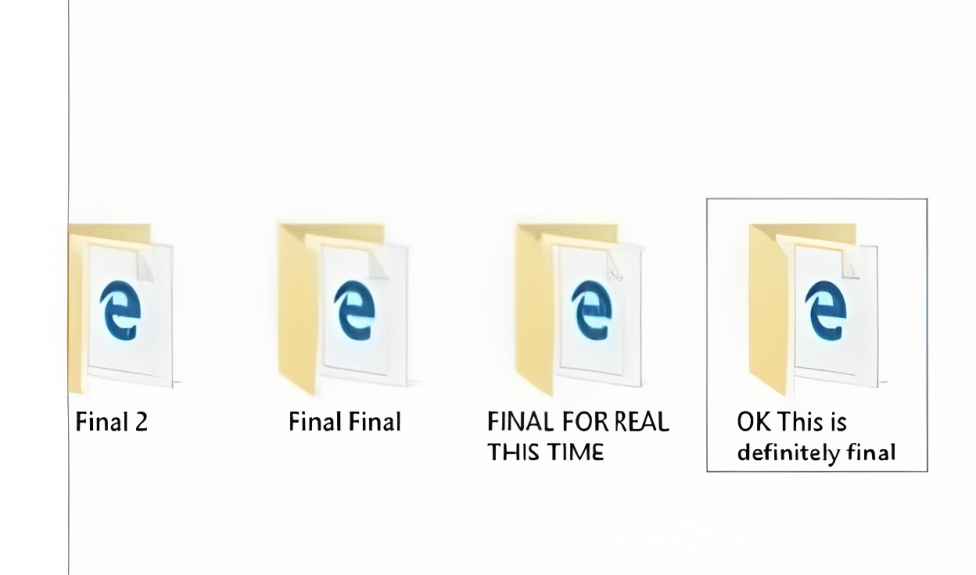

## Introduction:
As a developer, managing your code can be difficult, and you're always changing it, adding new features, and removing bugs from your application, so you need a way to track your code and make sure you don't miss any of the changes. So for that, you need to learn Git and GitHub.

## Before Git:
But before I was using Git, My code folder structure was something like this:  

Every time I was working on a project, I made a copy of that folder and then made changes to it, which led to the destruction of your application.

## Importance of Git
There are multiple reasons why you should use git and GitHub.

- Using Git and GitHub, you can save different versions of code without losing any data.  
- When you publish your code, others can view it, read it, and even contribute to your project.  
- There is the option of adding documentation to your code, so that if you forget how it works, you can refer to or read the documentation to run it.
### Personal Experience:
I can't tell you how many times I've lost data and code because I didn't use git and GitHub. I have worked on hundreds of projects, and one time I was not updating or saving my code on Github, and my computer crashed. All of my work and my code were gone. From that point on, I learned git and used GitHub to keep my code saved.

## What is Git? 
> Git is a version control system that allows you to contribute to existing projects or start new ones. 

> Git is a mature, actively maintained open source project originally developed in 2005 by Linus Torvalds, the famous creator of the Linux operating system kernel. A staggering number of software projects rely on Git for version control, including commercial projects as well as open source. Developers who have worked with Git are well represented in the pool of available software development talent, and it works well on a wide range of operating systems and IDEs (integrated development environments).

## What is GitHub:
> GitHub is a code hosting platform for collaboration and version control.

> GitHub lets you (and others) work together on projects.

## Important Terms:
So before you learn how to use git, you need to learn a couple of important terms, which are stated below:
1. Repositories
2. Branch 
3. Commits
4. Pull Requests
5. Push Request

