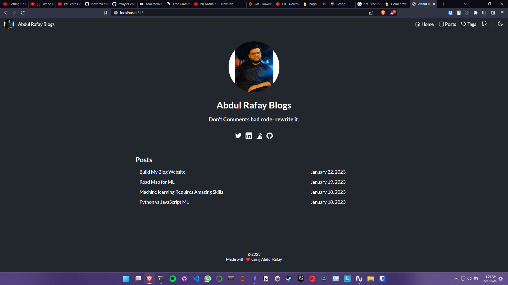

# Introduction:
I'm a developer, and I have been developing applications for a while, but with time, I have seen that my skills are increasing, but every time I learn something new, I forget the old thing.

I do make notes, but writing with my hands is not a great solution, so I decided to blog, but the question is, where? So I decided to try a different blogging website and a couple of note-taking applications.

Such as Medium or Notion, but these are great, but I didn't get the feel of writing blogs, and to be honest, the writing experience was just okay on Medium and Notion.

I love Markdown; it's flexible and works like a champ. I have been using markdown for something like three months, and I wanted some place where I could post my blogs in markdown.

Hey! What I'm thinking is that I am a developer; I can build a blogging website. It will be easy, and I can do whatever I want with it.

# Exiting Solutions
So I went online and started looking for existing solutions, and boy, did I find a lot of them, but they are either very time-consuming or lack the feature that I was looking for.

When I was researching for blog website, I have to make a couple of key choices that was, which technologies I will be using to develop and code my application, 

So before that, I need to decide whether I need a dynamic website or a static website since I want to post just blogs on my website, so I will go with a static website. There are a few good reasons to go with a static website, such as speed and ease of configuration and coding. Because I don't have time to build a dynamic website, I'm going with a static website, but you can choose your own framework, such as React, Angular, or any other framework.

Not just a any static website, I need a way to post blogs without creating an admin dashboard and this was super important, I am trying to avoid an entire full system. 

So after searching like alot I came across something called **HUGO**. 

# Desired characteristics:
So before we look at what I choose, here are the features that I am looking for in a blogging website.

- Post blogs using Markdown.  
- Easy to Post Blogs  
- There is no login.  
- No security  
- No ads  
- Good Color Scheme  
- Has the ability to switch between light and dark modes.  
- Blogs by Category  
- Tags for Blogs  
- Each blog's date and time  
- Support for code and images  
- The existing code is simple to read and modify

So these are some of the features that I am looking for. 

# The blog's purpose Website:
Since I am learning every single day, I want to save my progress, so I decided to create this blog website. which help me take notes and express my thoughts to the world.

# Site Link:

The website is active on the following Link: [rafayblog.tech](https://rafayblogs.tech)

# Licence
This repository is licensed under the MIT License. You can find the license in the [LICENSE]() file.

# Running Project Locally:
So if you want to checkout or run this website locally then follow these instructions.

## Required Applications:
In order to run this application on your system you need to install a couple of program:
1. git 
2. hugo

To install these Program follow these steps:
### Git:
To install git enter the following commands in the terminal:
#### Linux:
##### Debian or Ububtu:
```
sudo apt install git -y
```
##### Arch Linux:
```
sudo pacman -Syyu git --noconfirm --needed
```

#### Windows
**Install git using winget:**
```
winget install git
```
**Download an exe**
You can download an exe file by click [her](https://git-scm.com/downloads)

#### Mac Os 
```
brew install git
```
**Note:**
if Home Brew is not installed on your system then install it by using the follwong command:
``` bash
/bin/bash -c "$(curl -fsSL https://raw.githubusercontent.com/Homebrew/install/HEAD/install.sh)"
```
### HUGO:
To install hugo enter the following command in the terminal:

#### Linux:
##### Debian or Ububtu:
``` bash
sudo apt install hugo -y
```
##### Arch Linux:
``` bash
sudo pacman -Syyu hugo --noconfirm --needed
```

#### Windows
**Install git using scoop:**
```
scoop install hugo
```
**Note:** 
If Sccop is not install then  install sccop on your system by enter the following command in PowerShell:

``` PowerShell
Set-ExecutionPolicy RemoteSigned -Scope CurrentUser
irm get.scoop.sh | iex
```

#### Mac Os 
``` bash
brew install hugo
```
**Note:**
if Home Brew is not installed on your system then install it by using the follwong command:
``` bash
/bin/bash -c "$(curl -fsSL https://raw.githubusercontent.com/Homebrew/install/HEAD/install.sh)"
```

## Running Application:
1. Clone the Project by using the following command:
	``` git
	git clone https://github.com/rafay99-epic/Blog-website.git
	```
2. Enter the Folder using terminal:
	``` bash
	cd Blog-website
	```
3. Run the server using the following command:
	``` 
	hugo server
	```
4. Open your Browser and enter the following URL:
	```
	http://localhost:1313/
	```
5.  The you can see the website running on your local Machine. 



# Deployed Website:
The website is deployed on [render](https://render.com/) and the domain is from [Hostring](https://www.hostinger.com/).
All of the code is available on [Github](https://github.com/rafay99-epic/Blog-website)
To see how to deploy website on render plase follow this webpage from [freecodingCamp](https://www.freecodecamp.org/news/how-to-deploy-nodejs-application-with-render/)

# Coding Contribution:
For more features or face any issue free will to post on the issue section. Free will to fork this project and add more thing to this project.

***Note***:
All of the develoopment will be done in the [Develelopment-Branch](https://github.com/rafay99-epic/Blog-website/tree/Development-Branch), Once testing and approved then it will merged into the main branch, No code will be commmited into the main branch until is bug free and approved by the admin of the project.

Happy Coding…👋

# Contact Information:

**Author:** Abdul Rafay

**Email:** [99marafay@gmail.com](mailto:99marafay@gmail.com)
**Medium:** [99marafay](https://medium.com/@99marafay)

**Blog Website:** [rafayblogs.tech](https://rafayblogs.tech/)

**Portfolio Website:**  [rafay99.info](https://rafay99.info/)

